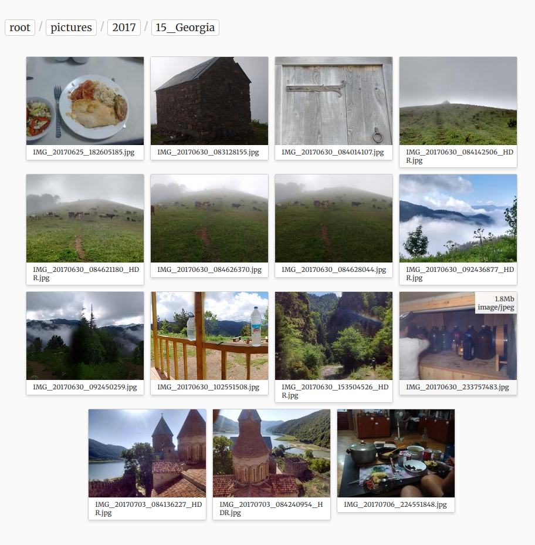

# BackBlaze-Cloud-Viewer

This is a little performant web app for browsing and viewing the contents of a B2 buckets. This is a read-only _cloud_ that generates thumbnails locally and caches the folder content lists to be performant.

This is using:

- [Sanic](https://github.com/huge-success/sanic) as the web-server
- [b2sdk](https://github.com/Backblaze/b2-sdk-python) for the connection to the bucket
- Pillow for image processing

## Installation

Exact dependencies are in the `pyproject.toml`. Best installed with poetry:

```bash
poetry install
```

## Configuration

Copy the `config.example.py` to `config.py` and edit all the variables (should be self explanatory). Authentication right now is done with simple HTTPAuth and one user. The point here is simplicity!

## Running

After installation running the Sanic web-server directly, without middleware is the easiest:

```bash
sanic server.app --host=0.0.0.0 --port=80 --workers=1 --no-access-logs
```

## Screenshots

